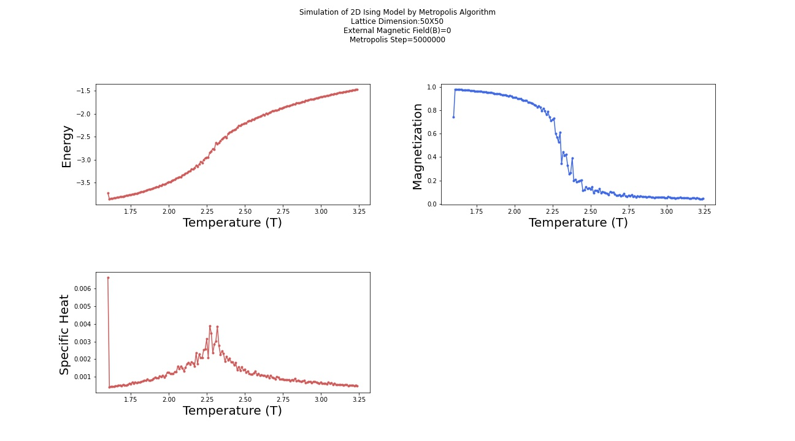

# IsingModel

## Project 
2d Ising model Monte-Carlo Simulation

Author: Mohamed Elashri 

Email: elashrmr@mail.uc.edu

## 2D Ising Model

The 2D Ising model is a mathematical model that is used to describe the behavior of a two-dimensional system of magnetic particles. The model was first introduced by physicist Wilhelm Lenz in 1920, and subsequently developed by physicist Ernst Ising in 1925. The model has been widely used in the study of phase transitions and critical phenomena in various systems, including ferromagnetic materials, superconductors, and biological systems.

In the 2D Ising model, each magnetic particle is represented by a spin variable, which can take on values of +1 or -1. The spins are arranged on a two-dimensional lattice, and interact with their nearest neighbors via a ferromagnetic interaction. This interaction is described by the Ising Hamiltonian, which has the form:

```math
H = -J * sum(s[i] * s[j]) $$
```

where J is the interaction strength, s[i] and s[j] are the spins at lattice sites i and j, and the sum is taken over all pairs of nearest neighbors.

At low temperatures, the spins in the 2D Ising model tend to align with their neighbors, resulting in a ferromagnetic state. At high temperatures, the thermal fluctuations are strong enough to cause the spins to randomly flip, resulting in a paramagnetic state. The transition between these two states is known as the Curie temperature, and is determined by the value of J and the temperature of the system.

The 2D Ising model has been studied extensively using both analytical and numerical methods. Analytical methods include the exact solution of the model in the one-dimensional case, as well as various approximate methods for the two-dimensional case. Numerical methods include Monte Carlo simulations, which allow for the study of large systems at finite temperatures.

One of the most important results of the 2D Ising model is the existence of a phase transition at the Curie temperature. This transition is associated with a change in the symmetry of the system, from a symmetric paramagnetic phase at high temperatures to a spontaneously broken symmetry ferromagnetic phase at low temperatures. The critical exponents associated with this phase transition have been calculated using various methods, and are in good agreement with experimental measurements.

Overall, the 2D Ising model is a powerful and widely used tool for understanding the behavior of magnetic systems and other systems exhibiting phase transitions and critical phenomena.


## Goal 

Apply the MC methods using Metropolis Algorithm to Ising model and extract physical parameters (Energy, Specific heat and Magnetization)

## Algorithm 
  1. Prepare some initial configrations of N spins. 
  2. Flip spin of a lattice site chosen randomly 
  3. Calculate the change in energy due to that 
  4. If this change is negative, accept such move. If change is positive, accept it with probability exp^{-dE/kT}
  5. repeat 2-4. 
  6. calculate Other parameters and plot them 

My code is very well commented with almost every part have comment that explain its function. reading the code should be something easy, just grab a coffee and enjoy. I always hated people who don't write enough comments or worse than that don't write any. This encouraged me to always to write comments with much details as much as possible. 

## Physical Model
Lattice is a periodical structure of points that align one by one. 2D lattice can be plotted as: 

```
* * * * * * * *   
* * * * * * * * 
* * * * * * * *
* * * * * * * *
* * * * * * * *
```

The points in lattice are called lattice points, neareast lattice points of point ^ are those lattice points denoted by (*) shown in the graph below:
```
* * *(*)* * * *
* *(*)^(*)* * *
* * *(*)* * * *
* * * * * * * *
```
Each lattice point is denoted by a number i in the Harmitonian.

The expression for the Energy of the total system is 

  


```math
H = - J \sum_{ i = 0 }^{ N-1 } \sum_{ j = 0 }^{ N-1 } (s_{i,j}s_{i,j+1}+s_{i,j}s_{i+1,j})
```


```
* * * * * * * * 
* * * * * * * *
* * * * * * * * <-the i-th lattice point
* * * * * * * *
* * * * * * * *
```

Periodical strcture means that lattice point at(1,1) is the same as that at(1,9) if the lattice is 5 by 8. more e.g.(1,1)<=>(6,1),
(2,3)<=>(2,11). A 2D lattice can be any Nx by Ny. The location (x,y) here is another denotion of lattice point that 
is fundementally same as i-th lattice point denotation above.

```
* * * * * * * * 4
* * * * * * * * 3
* * * * * * * * 2
* * * * * * * * 1
1 2 3 4 5 6 7 8 
```

## Results 

These are plots of the physical quantites for different MC steps. 





## Reproduction  
You can run the Jupyter Notebook provided on Colab directly or you can download and run locally. Also there is python script that you can run. I'm using Numba cache so that it produces cache folder (specific to machine CPU and configration) so that you will need to produce yours by running it for one time and susequent runs will be about twice faster.  

  <tr>
    <td class="tg-yw4l"><a href="https://colab.research.google.com/github/MohamedElashri/IsingModel/blob/main/Ising.ipynb">
    
    </a></td>
  </tr>
  
  
  To run the script 
  
  1. clone the repository 
  
       ``` git clone https://github.com/MohamedElashri/IsingModel ```
   
  2. run the script 


      ``` python3 IsingModel.py``` 


## Optimization
I spent many nights working on this work, most of time I needed to opptimize my code, 
I even tried to move to matlab (last time I used it was like 5 years ago). 
But I learned a nice thing from my desire to optimize code speed. it is the usage of Numba’s JIT compiler. read more about that here [link](http://melashri.net/url/b).
I also instead of using multiple nested loops I dragged all these into just one.
Imagine running 50x50 lattice simulation in my older codes for hours (one took 6 hours) vs 15 minutes for the currect script. (On my Mac m1 Machine). 
also I made the code avilable on colab and can be accssed here (without much comments) [link](http://melashri.net/url/c).

## Numba on Apple silicon (Mac m1)
Assuming that we are using Python3 version from homebrew not the one comes with OS which we shouldn't work with or try to modify except for Mac OS stuff. This can be done by adding the path to `.bashrc` or `.zshrc` by adding `export PATH="/usr/local/opt/python/libexec/bin:$PATH"` line to the either files.
 
 
To install Numba on Mac m1 we do the following 

```
python3 -m pip install  conda 
```

```
python3 -m pip install  cytoolz
```

```
python3 -m conda config --add channels conda-forge
```


```
python3 -m  conda install -c numba numba
```


